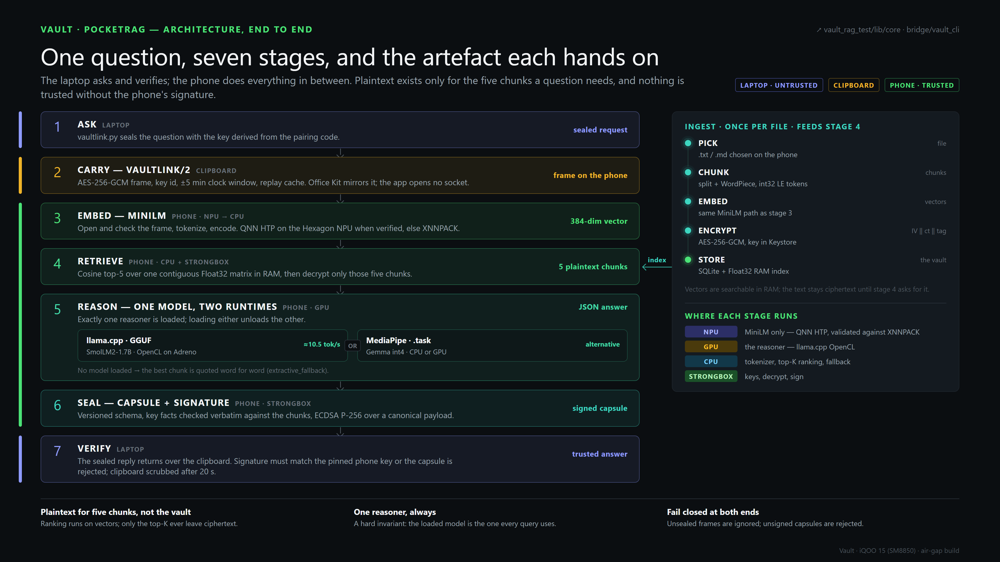
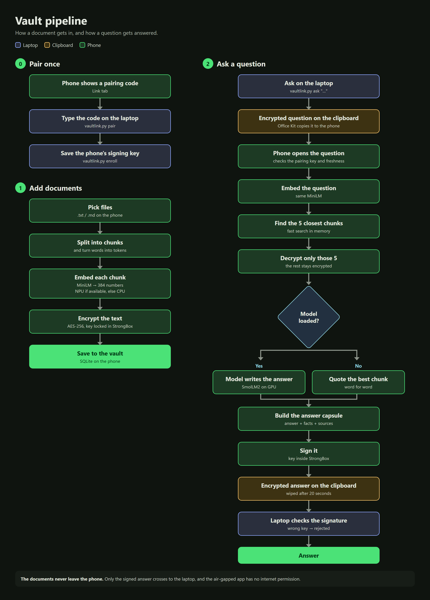

# Vault — private AI environment on the iQOO 15

**Your documents stay on the phone. Your laptop gets a signed answer.**

Vault turns an Android phone into a private co-processor for a laptop:

- **Phone:** stores the documents encrypted, searches them with an
  on-device encoder, and answers with an on-device language model.
- **What travels:** only a signed JSON *capsule*, over an encrypted clipboard
  link.
- **Laptop:** checks the signature before trusting the answer.



## How a question is answered



| # | Stage | Where | Hands on |
|---|---|---|---|
| 1 | **Ask**: `vaultlink.py` seals the question | laptop | sealed request |
| 2 | **Carry**: VAULTLINK/2 frame, AES-256-GCM, replay and clock checks | clipboard (Office Kit) | frame on the phone |
| 3 | **Embed**: MiniLM-L6-v2, QNN HTP → XNNPACK → CPU | phone | 384-dim vector |
| 4 | **Retrieve**: cosine top-5 in RAM, decrypt only those five | phone, CPU + StrongBox | 5 chunks |
| 5 | **Reason**: the one loaded model writes the answer | phone, GPU | JSON answer |
| 6 | **Sign**: quoted facts checked verbatim, ECDSA P-256 | phone, StrongBox | signed capsule |
| 7 | **Verify**: signature against the pinned phone key, clipboard scrubbed after 20 s | laptop | trusted answer |

With no model loaded, stage 5 quotes the best chunk word for word
(`extractive_fallback`). The capsule is still signed.

## Repository

| Path | What it is |
|---|---|
| [`vault_rag_test/`](vault_rag_test/README.md) | The phone app: Flutter UI, Kotlin/C++ native channels, llama.cpp submodule |
| [`vault_rag_test/NPU_QNN.md`](vault_rag_test/NPU_QNN.md) | Hexagon NPU (QNN HTP) bring-up and acceptance gates |
| [`vault_rag_test/BUILD_NOTES.md`](vault_rag_test/BUILD_NOTES.md) | Engineering notes: decisions and traps, in build order |
| [`bridge/`](bridge/README.md) | Laptop side: LAN bridge server, MCP server, `vault-embed` / `vault-query` |
| [`bridge/testdata/`](bridge/testdata/README.md) | `vaultlink.py` (clipboard client), synthetic sensitive-document eval |
| [`ARCHITECTURE.md`](ARCHITECTURE.md) | The system as built: components, data flow, compute placement |
| [`SECURITY.md`](SECURITY.md) | Threat model, signing format, what is and is not verified |
| [`deck/`](deck/README.md) | Generated submission deck (11 slides) |

## Quick start

```powershell
git clone --recurse-submodules <repo>
cd vault_rag_test
flutter build apk --release --flavor airgap     # no network permission
# install build\app\outputs\flutter-apk\app-airgap-release.apk on the phone
```

On the phone: open **Link**, tap **Pair a laptop** and **Start session**.
On the laptop, with Office Kit's clipboard sync on:

```powershell
cd bridge\testdata
python vaultlink.py pair XXXXX-XXXXX-XXXXX-XXXXX   # type the code shown on the phone
python vaultlink.py enroll                         # pin the phone's signing key
python vaultlink.py ask "What is the maximum notional order limit?"
```

The `lan` flavor (`--flavor lan`) adds `INTERNET` for the WebSocket bridge in
[`bridge/`](bridge/README.md).

## Status

| Claim | Result | Source |
|---|---|---|
| Keys in StrongBox | AES and ECDSA keys report StrongBox level | iQOO 15 (SM8850) |
| Signed capsules | valid ECDSA P-256, verified on the laptop | iQOO 15 |
| Reasoner | SmolLM2-1.7B Q4_K_M on llama.cpp GPU, ≈10.5 tok/s end to end | iQOO 15 |
| Retrieval | ≈2.0 s per question, mostly StrongBox decryption | iQOO 15 |
| Encoder | MiniLM on XNNPACK, 113–137 ms per query | iQOO 15 |
| NPU (QNN HTP) | NPU-shaped model exported (305 nodes, cosine 1.000000); **not yet confirmed on the phone** | open |
| Network | air-gap APK has no network permission (`aapt2`) | host |
| Tests | 236 Flutter tests, 66 Python tests, `flutter analyze` clean | host |

Known limits and next steps are listed in [`SECURITY.md`](SECURITY.md#known-limitations-and-next-steps).
